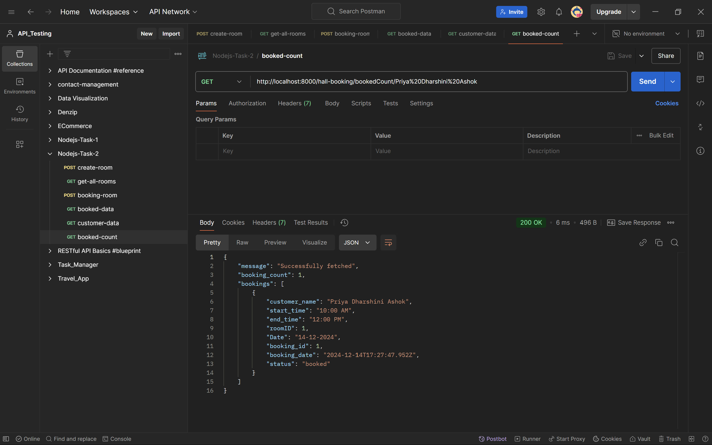
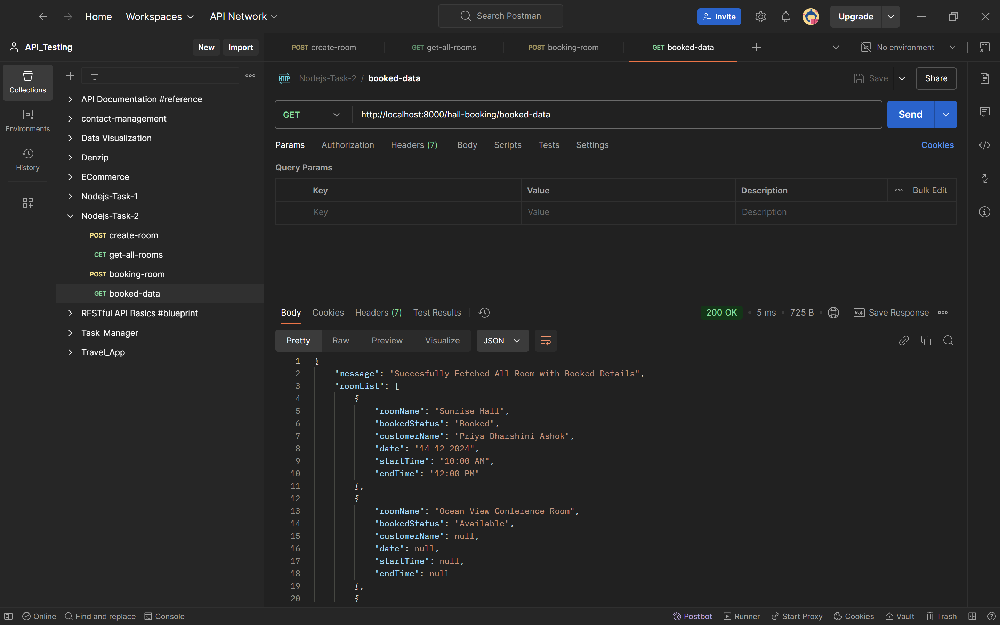
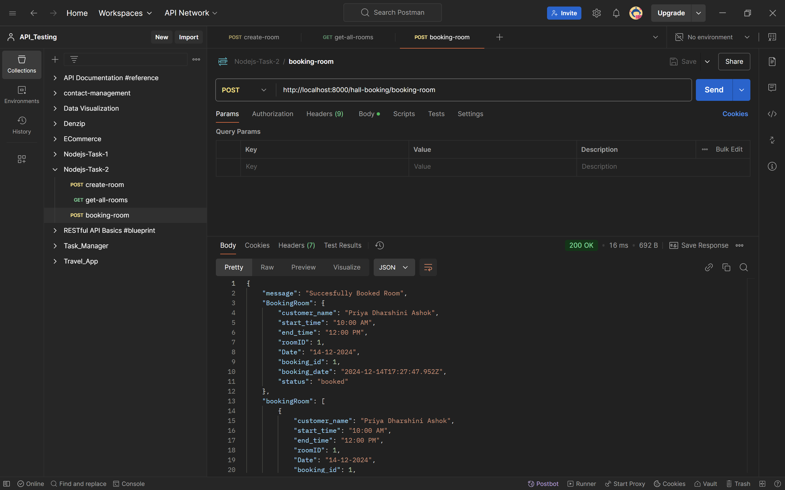
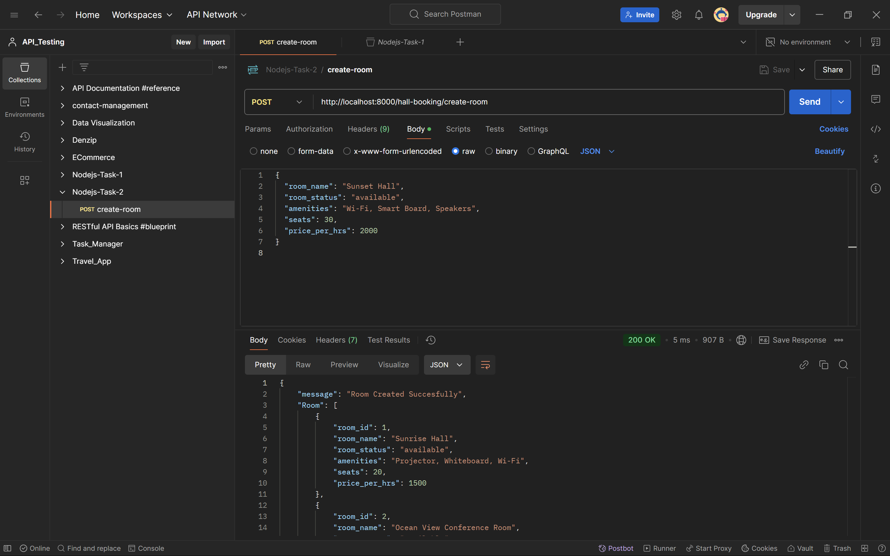
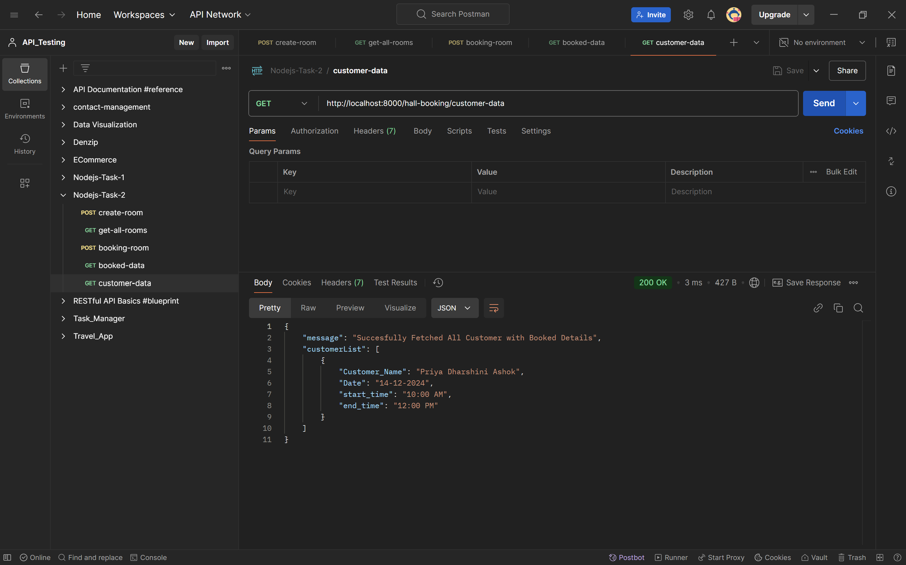
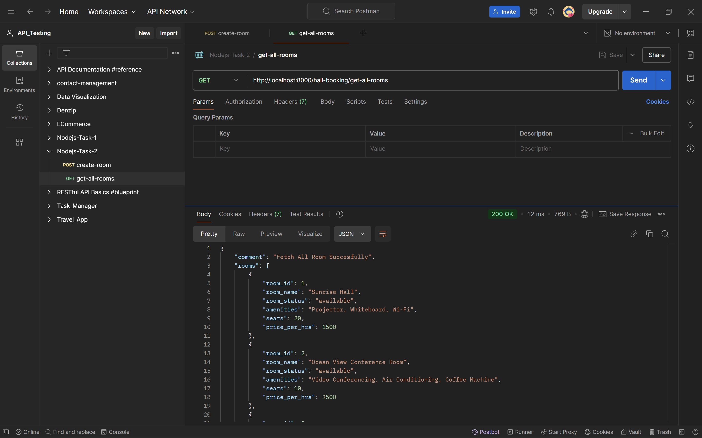
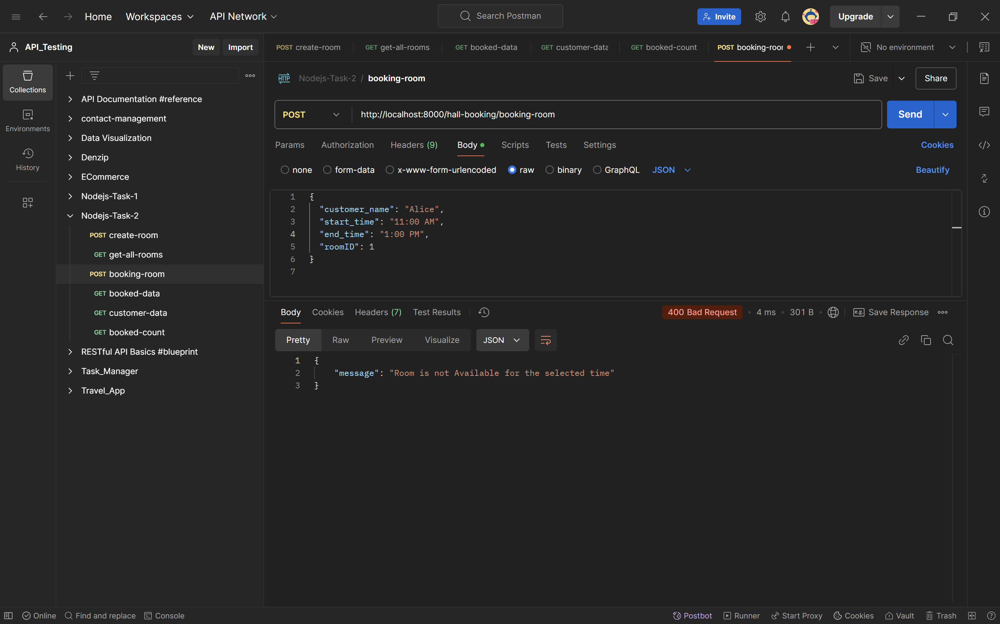

# Hall Booking API Development - NodeJs and Express

This is a simple Hall Booking API that allows users to:

- Create rooms
- View all rooms
- Book rooms [without conflicts]
- View booked room data
- View customer booking data
- Count how many times a customer has booked a room

### URL's
1. https://hall-booking-gwcz.onrender.com/hall-booking/create-room - CREATE ROOM

2. https://hall-booking-gwcz.onrender.com/hall-booking/get-all-rooms - ALL ROOM DETAILS

3. https://hall-booking-gwcz.onrender.com/hall-booking/booking-room - BOOK ROOMS [WITHOUT CONFLICTS]

4. https://hall-booking-gwcz.onrender.com/hall-booking/booked-data - VIEW BOOKED ROOM DATA

5. https://hall-booking-gwcz.onrender.com/hall-booking/customer-data - VIEW CUSTOMER DATA

6. https://hall-booking-gwcz.onrender.com/bookedCount/Priya%20Dharshini%20Ashok - BOOKED COUNT

### API Endpoints

1. **POST /create-room**  
   Create a new room with the following details:

   - Room Name
   - Seats
   - Price per hour
   - Amenities

   *Request:*

   json
   {
     "room_name": "Ocean View Conference Room",
     "seats": 10,
     "price_per_hrs": 2500,
     "amenities": "Video Conferencing, Air Conditioning, Coffee Machine"
   }
   

   *Response:*

   json
   {
     "message": "Room Created Successfully",
     "Room": [...]
   }
   

2. **GET /get-all-rooms**  
   Get the list of all available rooms.

   *Response:*

   json
   {
     "message": "Fetched All Rooms Successfully",
     "rooms": [...]
   }
   

3. **POST /booking-room**  
   Book a room by specifying:

   - Customer Name
   - Start Time
   - End Time
   - Room ID

   *Request:*

   json
   {
     "customer_name": "Alice",
     "start_time": "10:00 AM",
     "end_time": "12:00 PM",
     "roomID": 1
   }
   

   *Response:*

   json
   {
     "message": "Successfully Booked Room",
     "BookingRoom": {...},
     "bookingRoom": [...]
   }
   

4. **GET /booked-data**  
   Get all room booking details including the status of rooms, customer names, and times.

   *Response:*

   json
   {
     "message": "Successfully Fetched All Room with Booked Details",
     "roomList": [...]
   }
   

5. **GET /customer-data**  
   Get a list of customers along with their booked room data.

   *Response:*

   json
   {
     "message": "Successfully Fetched All Customer with Booked Details",
     "customerList": [...]
   }
   

6. **GET /bookedCount/:customer_name**  
   Get how many times a customer has booked a room.

   *Response:*

   json
   {
     "message": "Successfully fetched",
     "customer_name": "Alice",
     "booking_count": 2,
     "bookings": [...]
   }
   

### Images

Below are some visual representations of the functionality of the API.

1. **booked-count**: This screenshot shows how to get the count of bookings for a customer.

   

2. **booked-data**: This shows the API response for fetching booked data for all rooms.

   

3. **booking-room**: This screenshot shows the booking process for a room.

   

4. **create-room**: This shows the API response for creating a new room.

   

5. **customer-data**: This shows the customer booking data.

   

6. **get-all-rooms**: This shows the list of all available rooms.

   

# Overlap Handling - Booking same rooms will not be allowed

### Setup Instructions

1. Clone the repository:

   bash
   git clone <repo-url>
   

2. Install dependencies:

   bash
   npm install
   

3. Run the application:

   bash
   npm start
   

4. The API will be available at http://localhost:8000.